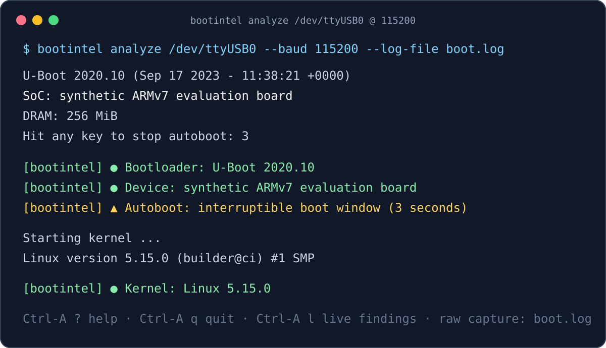
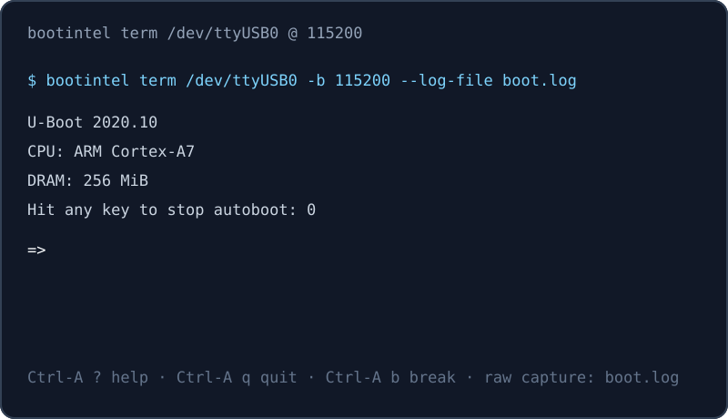
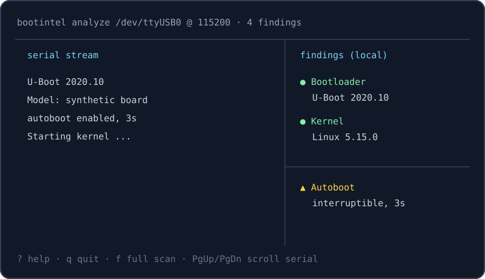

# bootintel — Rust CLI

[](https://github.com/BootIntel/cli/actions/workflows/ci.yml)
[](https://github.com/BootIntel/cli/releases/latest)
[](LICENSE)


**A full UART terminal that understands boot logs.** Capture a serial session, save the raw bytes, and identify bootloaders, kernels, devices, and risky boot settings as they arrive. Local identification is free and works offline; opt-in server analysis adds CVE matching and reports.

<p align="center">
  
</p>

## Start in 60 seconds

Download the [latest release](https://github.com/BootIntel/cli/releases/latest), verify it with [SHA256SUMS](https://github.com/BootIntel/cli/releases/latest), then:

```sh
# Find the USB serial adapter.
bootintel ports

# Open the UART, preserve the raw capture, and identify the boot log live.
bootintel analyze /dev/ttyUSB0 --baud 115200 --log-file boot.log

# Re-scan the saved capture later, fully offline.
bootintel scan boot.log --format text
```

On Windows, use a COM port such as `COM3`. See the [getting-started and troubleshooting guide](docs/getting-started.md) for installation, permissions, and a hardware-free virtual-PTY demo.

## What it looks like

| Terminal | Live analysis dashboard | Saved-log scan |
| --- | --- | --- |
|  |  | `bootintel scan boot.log --format sarif` works in CI or from a saved capture. |

## Why BootIntel alongside a serial terminal?

BootIntel is designed to replace the common UART terminal workflow when the boot output itself matters. It retains the interactive controls engineers expect while making a captured boot log useful immediately.

| Capability | BootIntel | minicom / picocom / tio | screen |
| --- | --- | --- | --- |
| Interactive serial terminal | Yes | Yes | Yes |
| Baud, parity, data bits, flow control | Yes | Yes | Yes |
| Raw serial log file | Yes | Yes | Yes |
| Terminal controls, break, DTR/RTS, reconnect | Yes | Varies by tool | Limited |
| Identify bootloader, kernel, and device from output | **Live and offline** | — | — |
| Surface risky boot settings during capture | **Live and offline** | — | — |
| Scan saved logs as text, JSON, SARIF, or JUnit | **Yes** | — | — |
| Diff, replay, batch, and CI gate boot logs | **Yes** | — | — |
| Optional CVE and exploit-path analysis | **Explicit opt-in** | — | — |

Use `bootintel term` when you want a clean terminal and `bootintel analyze` when you want the same terminal with live boot-log intelligence.

## Common workflows

| Goal | Command | Result |
| --- | --- | --- |
| Inspect a newly connected adapter | `bootintel ports` | Lists candidate ports with USB VID/PID and product metadata when available. |
| Capture and analyze a boot | `bootintel analyze /dev/ttyUSB0 -b 115200 --log-file boot.log` | Preserves raw bytes and prints local findings as the device boots. |
| Analyze a log without hardware | `bootintel scan boot.log --format text` | Runs the local detector set without an account or network connection. |
| Compare firmware boots | `bootintel diff before.log after.log` | Shows meaningful boot-log changes between two captures. |
| Gate a build artifact | `bootintel scan boot.log --format sarif --gate-critical` | Emits CI-friendly output and exits non-zero for critical findings. |
| Request richer analysis | `bootintel scan --api --preview boot.log` | Explicitly sends the log to BootIntel's API using the anonymous preview quota. |

## Privacy and terminal safety

- Local detection runs on your machine and never requires an account.
- BootIntel does not send serial input automatically. Any write, break, modem-line action, or full analysis is initiated by you.
- `--log-file` writes raw capture bytes only to the path you choose. Bytes
  are flushed as they arrive, so the capture survives Ctrl-C, a closed
  terminal window, an unplugged adapter or a suspended laptop — and you can
  `tail -f` it from another terminal while the session runs.
- Server analysis is opt-in: use `--api` or `--api --preview`; the CLI states when it is submitting a log.
- Release artifacts include SHA256 checksums. See [SECURITY.md](SECURITY.md) for reporting guidance.

Subcommands include `scan`, `share`, `ports`, `version`, `term`, `analyze`, plus 15+ others (`batch`, `diff`, `watch`, `cve`, `bench`, `replay`, `manpage`, `detectors`, `schema`, `export`, `view`, `demo`, `init`, `doctor`, `completions`).

## Install

```
# One-liner (Linux + macOS, x86_64 + aarch64):
curl -sSfL https://raw.githubusercontent.com/bootintel/cli/main/packaging/scripts/install.sh | sh

# Windows (PowerShell, x86_64):
iwr -useb https://raw.githubusercontent.com/bootintel/cli/main/packaging/scripts/install.ps1 | iex

# Docker:
docker run --rm -i ghcr.io/bootintel/cli:latest scan - < boot.log

# Nix flake (in-repo):
nix run github:bootintel/cli -- version

# Cargo (from crates.io):
cargo install bootintel-cli

# Cargo (from a source checkout):
cargo install --path crates/cli --features tui
```

**GitHub Actions** (reusable composite action):

```yaml
- uses: bootintel/cli/.github/actions/bootintel-scan@cli-v0.4.0
  with:
    log-file: artifacts/boot.log
    format: sarif
    output-file: bootintel.sarif
    gate-critical: true
    version: 0.4.0   # pin the binary too
```

Pin to a release tag (`@cli-v0.4.0`) or a commit SHA — **never `@main`** (a compromised `main` would execute arbitrary shell in every consumer's pipeline).

**Homebrew:** the formula template lives at `packaging/homebrew/bootintel.rb`. A public `bootintel/homebrew-tap` for `brew install bootintel` is planned.

**crates.io:** `cargo install bootintel-cli` installs the latest published release. Note that this builds from source, so it needs a Rust toolchain and takes a few minutes; the one-liner above drops a prebuilt binary in seconds. See [docs/releasing.md](docs/releasing.md) for how releases are cut.

**Windows:** the one-liner above downloads + SHA256-verifies the latest release, extracts `bootintel.exe` into `$env:USERPROFILE\.local\bin`, and prints a `setx PATH` line if that dir isn't already on your PATH. Override with `$env:BOOTINTEL_VERSION` / `$env:BOOTINTEL_INSTALL_DIR`, or use `$env:BOOTINTEL_TARBALL` for offline installs. Currently x86_64 only — ARM64 users need `cargo install --path crates/cli --features tui`.

### Verify a download

Checksums for every release are in `SHA256SUMS`:

```sh
sha256sum -c SHA256SUMS --ignore-missing
```

Every archive also carries a signed [build-provenance attestation](https://docs.github.com/actions/security-for-github-actions/using-artifact-attestations). That binds the artifact to the workflow, repository and commit that built it — a stronger statement than a code-signing certificate, which only says an organisation paid a CA:

```sh
gh attestation verify bootintel-v0.4.0-x86_64-linux.tar.gz --repo BootIntel/cli
```

Container images are attested the same way:

```sh
gh attestation verify oci://ghcr.io/bootintel/cli:latest --repo BootIntel/cli
```

## Build from source

```
cargo build --release
./target/release/bootintel version
./target/release/bootintel demo                          # embedded sample, no files needed
./target/release/bootintel scan ./samples/bootintel-4.txt --format text
./target/release/bootintel share ./samples/bootintel-4.txt
./target/release/bootintel ports
```

## Subcommands

| Subcommand | What it does |
| --- | --- |
| `bootintel scan <file>` | Analyze a saved boot log. Supports `--format json\|text\|sarif\|junit` and `--gate-critical` for CI gating on autoboot / telnet exposure. `-` reads from stdin. `--api` POSTs to bootintel.com for full CVE + exploit paths (needs `BOOTINTEL_API_KEY`); `--api --preview` uses the anonymous free quota (3/day per IP, no key). `--api-base` overrides the endpoint. |
| `bootintel share <file>` | Print a bootintel.com share URL with the log embedded via lz-string compression. Nothing is uploaded — the log lives in the URL itself. |
| `bootintel ports` | List serial ports on this machine with USB VID/PID + product info when known. |
| `bootintel version` | Version, detector count, build metadata. |
| `bootintel term <port>` | Interactive picocom-shaped UART terminal. `--baud` / `--data-bits` / `--parity` / `--stop-bits` / `--flow-control` for serial config. `--log-file <path>` captures raw bytes in parallel. Ctrl-A q to quit, Ctrl-A ? for help, Ctrl-A Ctrl-A to send literal 0x01. |
| `bootintel analyze <port>` | Term + streaming client-side detector analysis. Findings surface as `[bootintel] ● Bootloader: U-Boot 2020.10` inline lines interleaved with the raw serial stream. All `term` flags plus `--no-live-display` to suppress inline output. Extra Ctrl-A hotkeys: `l` toggle live display, `c` clear + re-scan, `s` save findings JSON, `u` copy share URL to clipboard, `f` full server-side analysis when armed with `--api` / `--api --preview`. `--tui` renders a split-screen ratatui dashboard instead of the inline picocom-shaped output; PgUp/PgDn/Home/End scroll the serial pane (needs the `tui` build feature). |

### Interactive smoke test (needs a real terminal)

For a fully interactive shakedown without physical hardware, use a socat virtual PTY pair:

```
# terminal A:
socat -d -d pty,raw,echo=0 pty,raw,echo=0
# note the two /dev/pts/N paths in socat's output

# terminal B (the "device" side — types into the terminal):
echo "U-Boot 2020.10 (Sep 17 2023 - 11:38:21 +0000)" > /dev/pts/N1

# terminal C (the "engineer" side — runs bootintel):
bootintel term /dev/pts/N2 --log-file boot.log
```

Interactive hotkeys are unit-tested in the `hotkey` module (15 tests covering Ctrl-A q, Ctrl-A ?, Ctrl-A Ctrl-A, Ctrl-A l/c/s/u/f, unknown commands, printable / arrow / Ctrl-letter passthrough).

## Server-side integration

Client-side scan is always free and offline. Server-side integration (paid) layers full CVE matching, exploit paths, and (paid tiers) an AI-generated summary on top.

```
# free anonymous preview — 3/day per IP, no account:
bootintel scan --api --preview boot.log

# authenticated full analysis — needs an API key:
export BOOTINTEL_API_KEY=bik_...
bootintel scan --api boot.log

# self-hosted / staging (also honors $BOOTINTEL_API_BASE):
bootintel scan --api --preview --api-base https://staging.bootintel.com boot.log
```

### Environment variables

| Variable | Effect |
| --- | --- |
| `BOOTINTEL_API_KEY` | Sent as `X-API-Key` on `--api` (non-preview) requests. Read in-memory only — never persisted. To keep the key out of shell history + `ps auxe`, use `read -s BOOTINTEL_API_KEY && export BOOTINTEL_API_KEY`. |
| `BOOTINTEL_API_BASE` | Override the API base URL (equivalent to `--api-base`). Useful for self-hosted BootIntel deployments and for pointing at a staging environment. |
| `BOOTINTEL_NO_HISTORY` | Set to `1` to disable the `bootintel history` write-log. Also settable persistently via `bootintel config set no_history true`. |

In `bootintel analyze`, Ctrl-A f triggers the same POST against the log-so-far and prints the server response inline. Passing `--api` / `--api --preview` on the analyze subcommand arms the hotkey; without it, Ctrl-A f prints a hint.

Rate-limit UX: `HTTP 429` is never a silent fallback to client-side. The CLI prints a specific message (retry-after seconds when the server sends `Retry-After`) and exits non-zero (75, EX_TEMPFAIL). Other errors likewise map to sysexits-style codes so CI can dispatch:

| Exit | Meaning | Trigger |
| --- | --- | --- |
| 0   | OK | the scan ran and recognized at least one thing |
| 1   | gate failure | `--gate-critical` and a critical finding fired; a failed `--gate` assertion; `--baseline` drift |
| 2   | empty / unusable input | the log was empty or whitespace only — **nothing was inspected** |
| 3   | nothing recognized | the log had content but matched no detector |
| 65  | EX_DATAERR | server rejected the request body (log too large) |
| 69  | EX_UNAVAILABLE | network / DNS / TLS failure |
| 75  | EX_TEMPFAIL | rate-limited (429) |
| 76  | EX_PROTOCOL | server 5xx or malformed response body |
| 77  | EX_NOPERM | 401/403 auth failure |

### 2 and 3 exist so an empty capture can't pass a gate

`scan` used to exit 0 on a 0-byte file, so `--gate-critical` reported
green for a CI job whose UART never came up, whose adapter fell out, or
whose artifact path was wrong. An empty capture is not a clean bill of
health — it is the absence of evidence, and the two are not the same
result.

Codes 2 and 3 match the legacy Node analyzer's ladder, so a pipeline can
be pointed at either implementation and dispatch the same way. Treat
**any** non-zero exit as "do not merge":

```sh
bootintel scan boot.log --format sarif --gate-critical > results.sarif
case $? in
  0) echo "clean" ;;
  1) echo "critical exposure found"       ; exit 1 ;;
  2) echo "capture was empty — did the UART come up?" ; exit 1 ;;
  3) echo "nothing recognized — wrong baud, or capture started too late" ; exit 1 ;;
  *) echo "scan failed"                    ; exit 1 ;;
esac
```

The `json` envelope carries the same answer in the added
`analysis_status` field (`matched` / `unrecognized`), so a consumer
parsing stdout does not have to infer it from an empty `findings` array.

Response schema is auto-follow with graceful degrade (Stripe-style): unknown fields are preserved via a passthrough map so a server-side schema addition never crashes an older CLI. See `api/response.rs` for the parser.

## TUI dashboard

`bootintel analyze --tui <port>` swaps the picocom-shaped inline output for a split-screen ratatui dashboard:

```
┌ bootintel analyze /dev/ttyUSB0 @ 115200 ── 2:14 ── 3.2 KiB ── 5 findings ─────┐
│                                     │  findings (client) — 5                   │
│  serial stream                      │  ● Bootloader     U-Boot 2020.10         │
│  (autoscroll, PgUp to hold)         │  ● Kernel         Linux 5.15             │
│                                     │  ⚠ Autoboot       Hit any key to stop…   │
│  U-Boot 2020.10 (Sep 17 …)          ├──────────────────────────────────────────┤
│  Model: TP-Link Archer C7           │  server — ok (12s ago)                   │
│  autoboot enabled, 3s               │  device: Archer C7                       │
│  ...                                │  5 findings — 3 shown, 2 hidden          │
│                                     │  ● Bootloader   U-Boot 2020.10           │
│                                     │  ● Autoboot     …  CVE-2023-1234 (CVSS…) │
└─ ? help  ·  q quit  ·  f full-scan  ·  l pause  ·  c clear  ·  PgUp/PgDn ─────┘
```

Ctrl-A hotkeys work identically to inline mode. Extra keys: PgUp/PgDn scroll the serial pane, Home jumps to oldest, End pins back to newest. Feature-flagged so headless CI builds stay small — enable with `cargo build --features tui`. When the feature is off, `--tui` fails with a specific rebuild hint (never a silent fallback to inline mode).

Binary cost: 149 KiB when the feature is on (2.87 MiB no-tui → 2.96 MiB with-tui). ratatui uses the crossterm backend the CLI already links, so no extra terminal deps.

## Distribution

Build infrastructure is shipped. To cut a release:

1. Bump `crates/cli/Cargo.toml` version (also affects `bootintel-detectors` via workspace inheritance).
2. Update `CHANGELOG.md` — move `[Unreleased]` items into a new `[X.Y.Z]` section.
3. Merge to `main` (or run from a branch — the workflow accepts any ref).
4. Actions → cli-release → Run workflow → enter the version (e.g. `0.1.0`), leave `dry_run` off, tick `publish_docker` if you also want the ghcr image.
5. Wait ~15 minutes. Actions produces a DRAFT release with 5 tarballs + SHA256SUMS.
6. Review the artifacts, then publish the draft manually. Nothing is public until you hit "Publish release".
7. Once published, populate `packaging/homebrew/bootintel.rb` SHA256 values + create `Zenofex/homebrew-bootintel` tap.

Files:

```
CHANGELOG.md                      # Keep-a-Changelog, semver-disciplined
Dockerfile                        # multi-stage rust-bookworm → distroless-cc
flake.nix                         # reproducible Nix build + devshell
packaging/
├── homebrew/bootintel.rb         # formula template (no public tap yet)
├── scripts/install.sh            # POSIX shell installer (Linux + macOS)
└── scripts/install.ps1           # PowerShell installer (Windows)

.github/
├── workflows/cli-release.yml     # 5-platform matrix, workflow_dispatch only
└── actions/bootintel-scan/action.yml # reusable composite action
```

Distribution scope deliberately excludes: no auto-update (attack surface), no telemetry (off by default), no winget submission, no apt repo. Those are follow-ups based on demand.

## Workspace layout

```
Cargo.toml                       # workspace manifest
crates/
├── detectors/                   # pure client-side detector library
│   ├── src/lib.rs               # 9 detectors
│   └── tests/detector_tests.rs  # unit tests
└── cli/                         # the `bootintel` binary
    ├── src/
    │   ├── main.rs              # clap arg parsing + subcommand dispatch
    │   ├── cmd/                 # one module per subcommand
    │   │   ├── scan.rs
    │   │   ├── share.rs
    │   │   ├── ports.rs
    │   │   └── version.rs
    │   └── output.rs            # json / text / sarif / junit formatters
    └── tests/
        ├── corpus_smoke.rs      # golden-fixture assertions against the sample corpus
        └── share_roundtrip.rs   # lz-string round-trip tests
```

### term/ module

```
crates/cli/src/term/
├── mod.rs      — module glue
├── hotkey.rs   — Ctrl-A escape state machine (pure, unit-tested)
├── raw_mode.rs — RAII guard that restores terminal on drop even under panic
├── logfile.rs  — BufWriter for --log-file, flushed per read so the
│                capture is durable + tailable; error-tolerant on disk-full
├── signals.rs  — SIGINT/SIGTERM/SIGHUP → graceful exit (restores the
│                terminal, flushes the capture)
└── run.rs      — main terminal loop (2 background threads + mpsc), takes optional analyzer
```

### analyze/ module

```
crates/cli/src/analyze/
├── mod.rs      — module glue
├── dedupe.rs   — finding dedupe set keyed on (label, value, source)
├── pacer.rs    — re-run scheduler: 5 new lines OR 500ms, whichever first
├── render.rs   — [bootintel] inline printer + save-summary JSON writer
└── state.rs    — owns log buffer + dedupe + pacer; feed() / maybe_tick() / reset_and_rescan()
```

`bootintel analyze` is `bootintel term` plus an `Option<AnalyzeState>` in `TermOptions`. When present, the shared term loop feeds serial bytes into the analyzer after writing them to stdout; new findings surface as inline `[bootintel] ●` lines. When absent (the term-mode case), the loop skips those steps entirely. One loop, two subcommands.

### api/ module

```
crates/cli/src/api/
├── mod.rs        — module glue
├── endpoints.rs  — URL builders + DEFAULT_API_BASE
├── client.rs     — ureq sync client + typed ScanError classification
├── response.rs   — graceful-degrade parser: known fields modeled, unknown fields flow into `extra`
└── render.rs     — text + JSON output for server responses; JSON round-trips unknown fields
```

The Ctrl-A f hotkey path in analyze mode reuses the same `ScanClient` — one HTTP client for both `scan --api` and analyze-mode full analysis. When Ctrl-A f fires, the term loop restores cooked mode, POSTs synchronously, renders the response, then re-enters raw mode. The user sees a `submitting X bytes to bootintel.com...` line so the pause is explained.

### tui/ module (feature-gated)

```
crates/cli/src/tui/
├── mod.rs      — module glue (only compiled when --features tui)
├── app.rs      — App state (serial buffer, findings, scroll, api status)
├── render.rs   — pure draw(&mut Frame, &App): title + serial pane + findings pane + server pane + status bar
└── run.rs      — mpsc loop identical in shape to term/run.rs; feeds App instead of writing bytes to stdout, redraws on every event or ~80ms tick
```

The tui loop reuses `AnalyzeState` + `ScanClient` + `ApiConfig` unchanged. When `--tui` fires, cmd/analyze.rs constructs the same `TermOptions` it would for inline mode and hands it to `tui::run::run` instead of `term::run::run`. One state, two renderers.

## Output stability

`bootintel scan --format json <file>` produces a stable envelope:

```json
{ "bootintel_version": "...", "analysis_source": "client", "detector_count": N, "findings": [...] }
```

Downstream consumers reading `.findings[]` can rely on the array shape across releases. The envelope grows additively (new top-level fields never break parsing).

Two fields were added and no existing key changed name or meaning:

| Field | Where | Meaning |
| --- | --- | --- |
| `analysis_status` | envelope | `matched` or `unrecognized` — pairs with exit codes 0 / 3 |
| `line_number` | each finding | 1-based line of `source` in the analyzed log; omitted when unknown |

`source` now carries the **original** log line, prefix and all, rather
than only the substring the detector regex matched. Prefixed captures
(`[12:34:56.789] `, ISO-8601 timestamps, ANSI colour) are normalized
before matching, so a line-anchored detector still fires — but the
evidence shown back to you is what your capture actually contained.

SARIF v2.1.0 and JUnit XML outputs conform to their respective specs and validate against GitHub Code Scanning and standard `junit-report` consumers.

`--gate-critical` returns exit 0 (no critical exposures) or 1 (at least one — currently `Autoboot interruptable` or `Telnet exposure`). It returns 2 for an empty capture and 3 when nothing was recognized; see the exit-code table above — an empty capture must never read as a passing gate.

## Detector sync discipline

Nine detectors live at `crates/detectors/src/lib.rs` and mirror the browser detector library at bootintel.com/tools/fingerprint. When adding a detector, keep the label set aligned between the two so JSON output round-trips cleanly.

## Contributing

Contributions welcome. See [CONTRIBUTING.md](CONTRIBUTING.md) for the build loop, coding standards, and PR workflow. Adding a detector? [Contributing → Adding a detector](CONTRIBUTING.md#adding-a-detector). Adding a subcommand? [Contributing → Adding a subcommand](CONTRIBUTING.md#adding-a-subcommand).

## Security

Security issues go to hello@bootintel.com — please don't file them as public GitHub issues. Full disclosure policy + threat model in [SECURITY.md](SECURITY.md).

## License

Apache-2.0. See [LICENSE](LICENSE).
